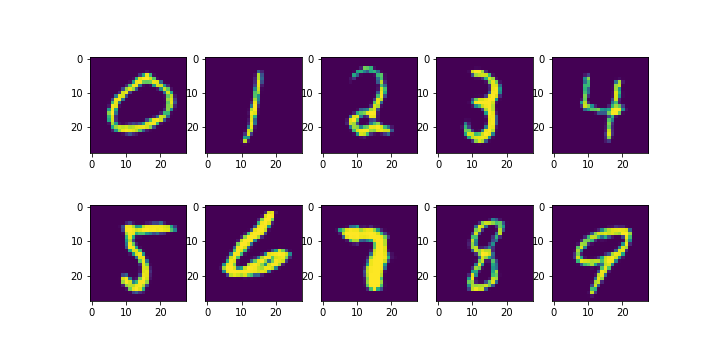

# cDCGAN-MNIST
Conditional Deep Convolutional GAN for MNIST

#### Generated digits ####

Main parts of GAN was taken from this repository:
[https://github.com/utkd/gans](https://github.com/utkd/gans)

The most noticeble change is that now discriminator performs multiclass classification: 10 for real images + 10 for fakes. This approach can't be assumed as superior to common binary classification due to lack of research, but at least it works not worse in this task.

Of course, it can be done only with labeled data.

In file 'number' we count digits in text and generate hand written image of the most popular number.

## Dependencies

 - python 3.5.2
 - TensorFlow 1.12.0
 - Keras 2.2.4
 - numpy 1.15.4

## Some refs about GANs

 - [GAN Keras and explanation](https://towardsdatascience.com/gan-by-example-using-keras-on-tensorflow-backend-1a6d515a60d0)
 - [GAN for CIFAR10, some advices](https://medium.com/@utk.is.here/keep-calm-and-train-a-gan-pitfalls-and-tips-on-training-generative-adversarial-networks-edd529764aa9)
 - [About deconvolution and checkerboard artifacts](https://distill.pub/2016/deconv-checkerboard/)
 - [Big article about GAN and it's problems](https://medium.com/@jonathan_hui/gan-why-it-is-so-hard-to-train-generative-advisory-networks-819a86b3750b)
 - [Another GAN Conditional DCGAN for MNIST](https://github.com/sarahwolf32/conditional-DCGAN-for-MNIST)

